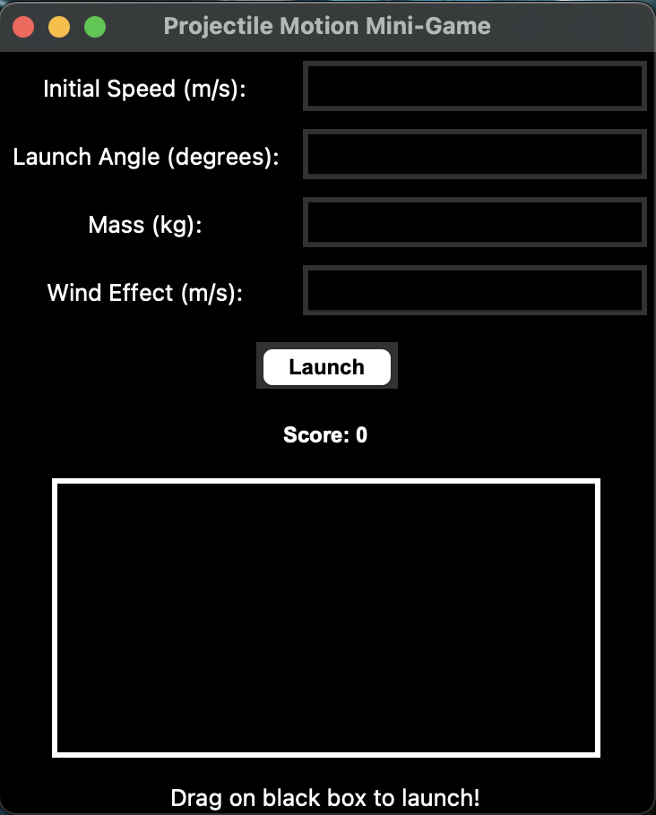
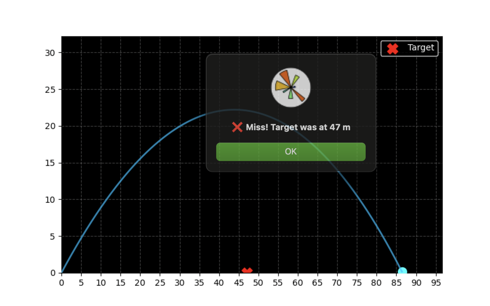

# Projectile Motion Simulation & Modeling

This project simulates projectile motion under gravity, air resistance, and wind effects using Python.

## Course
Simulation and Modeling

## Features
- Gravity-based motion
- Air resistance modeling
- Wind effect
- Numerical simulation
- Animation using Matplotlib
- Interactive GUI using Tkinter

## Tools Used
- Python
- Tkinter
- NumPy
- Matplotlib

## How to Run
```bash
python projectile_simulation.py

## Preview



